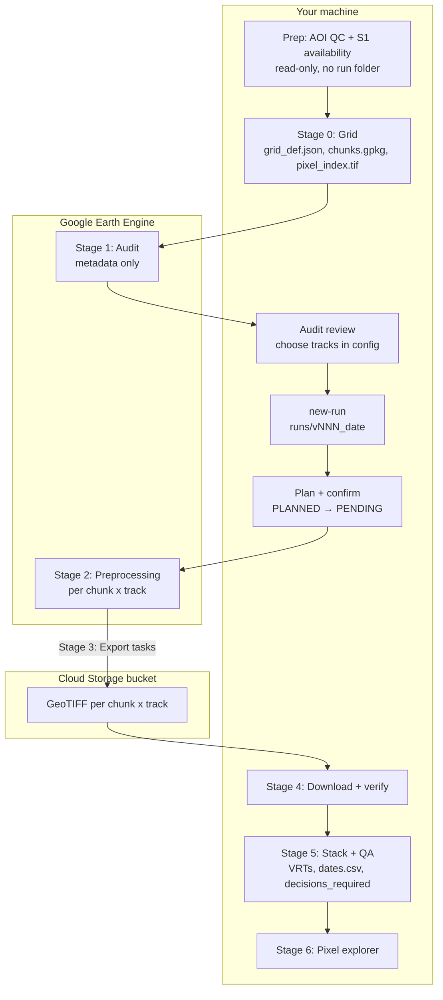
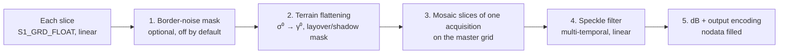
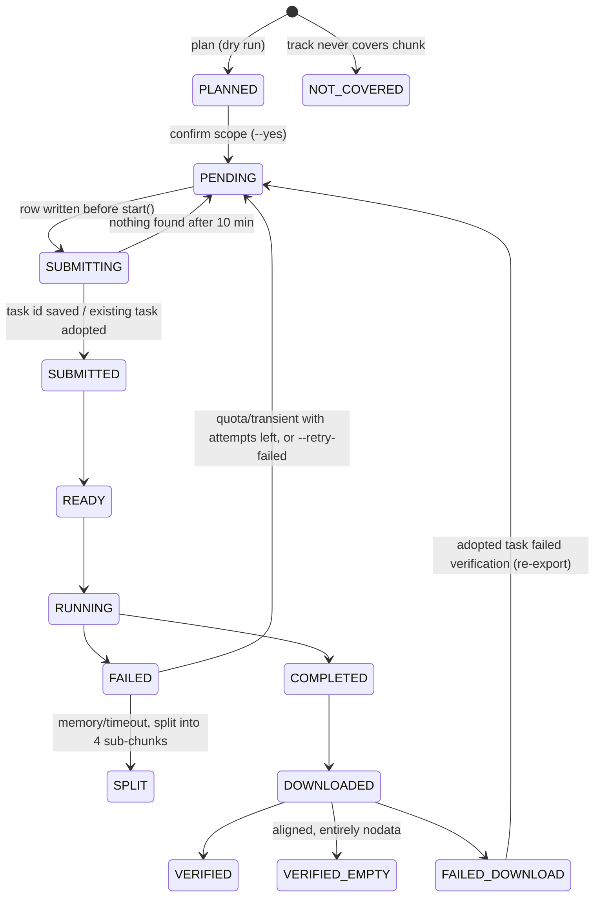

# 03 — Pipeline overview

This page explains **what each stage does, why it exists, and why the stages run in this order**.
For the exact commands, see the [runbook](04_runbook.md). For file contents, see
[05 Outputs](05_outputs_and_folders.md).



---

## Before Stage 0 — Prep checks (local + Earth Engine metadata)

Two checks that are not pipeline stages, because they write nothing and cost nothing, but that save
hours when they fail:

```bash
python -m sar_pipeline.prep aoi-qc          --config $CFG    # is the AOI file the AOI you think it is?
python -m sar_pipeline.prep s1-availability --config $CFG    # does Sentinel-1 cover it often enough?
```

**Why before the grid.** Stage 0 silently trusts two things nobody has verified: that `aoi.path` is
the complete, correctly deduplicated AOI, and that the season window actually holds enough
acquisitions to see a crop cycle. Building a grid, running an audit and submitting exports for a
mis-deduplicated AOI burns hours of Earth Engine quota before anyone notices.

- `aoi-qc` is **local only**. It reduces every geometry to canonical WKB (so identical shapes compare
  equal regardless of vertex order), counts distinct shapes, reports areas in acres, and — with
  `--split-dir` — names exactly which features a deduplicated per-AOI folder lost, gained or
  renumbered. It exits non-zero when the cross-check fails, so it can gate a script.
- `s1-availability` reads Earth Engine **metadata only** (one `reduceColumns` call): tracks, platforms
  and distinct acquisition dates per month. It needs no grid, so it is the step to run while you are
  still *choosing* `season.start` / `season.end`.

Neither step creates a run folder, an export task or a Cloud Storage object. Counts from
`s1-availability` are over the AOI **bounding box**, so use the audit (Stage 1), not this, to decide
`s1.tracks`. Details: [runbook step 0](04_runbook.md#step-0--prep-checks-and-pre-flight-checklist),
[developer/interfaces.md §6.0](developer/interfaces.md#60-prep-pre-flight-checks-no-exports).

---

## Stage 0 — Grid (local)

**What:** builds one **master grid** for the AOI: one projected CRS, a 10 m pixel size, and a top-left
corner snapped to a multiple of 10 m. The grid is cut into **chunks** (e.g. 512 × 512 px ≈ 5 km),
keeping only chunks that touch the AOI. It also writes the **pixel index raster**.

**Why:**
- Earth Engine exports each chunk separately. If each chunk used its own grid, chunks would be shifted by
  fractions of a pixel, the mosaic would show seams, and the same field would get different pixel ids.
  With one master grid, all chunk files line up exactly.
- Chunks keep every Earth Engine task small (it avoids the "memory limit exceeded" error) and every
  local file small (no out-of-memory crashes).
- **Pixel index:** each pixel gets an id `pid = row × width + col`. From a pid you get row and column by
  simple division, so reading one pixel's time series needs a 1 × 1 window read, never the full raster.

The grid is **immutable**: if you rebuild with a different AOI geometry or grid settings, `build_grid` refuses
(`GridMismatch`), because every pixel id would silently change. Only geometry counts: moving the AOI file to
another path, or tiny floating-point differences in the per-chunk AOI share on another machine, only log a warning.

---

## Stage 1 — Audit (Earth Engine metadata, no exports)

**What:** lists every Sentinel-1 image over the AOI in the season window and answers:

- Which **tracks** (relative orbit + pass) cover the AOI? How many acquisitions does each have?
- Where are the **gaps** longer than `audit.max_gap_days`? Do they coincide with known
  constellation events?
- What fraction of the AOI does each acquisition cover?
- Which platforms (S1A/C/D) contributed?
- How much **rain** fell in the 6 h / 24 h before each acquisition?
- How **steep** is the terrain (DEM slope statistics)?
- A **recommended** primary/secondary track.

**Why:** every later decision depends on this. Mixing tracks blindly adds geometry noise (see
[SAR basics §7](01_sar_basics.md#7-tracks-relative-orbits-and-incidence-angle)), and a silent gap in
the middle of the season would distort phenology features.

> **Checkpoint 1:** a human reviews the audit and writes the chosen tracks into `s1.tracks`.
> Later stages refuse to run (`AuditRequired`) until this is done.

**Slices vs acquisitions:** Earth Engine stores each ~170 km along-track piece ("slice") as a separate
image. The AOI may fall on the border of two slices of the same pass. The audit groups slices of the
same track taken within 15 minutes into **one acquisition**, so one pass is never counted as two dates.

**Request sizes stay bounded.** A country-scale AOI can have thousands of polygon parts and hundreds of
thousands of vertices, far beyond what one Earth Engine request accepts. The audit therefore never sends the
full AOI: it works on ~50 km blocks, simplifies every geometry to at most 2000 vertices, splits requests by
feature count and payload size, and pages results. Slope percentiles are computed from per-block histograms
merged locally.

Audit folders are named by **UTC date**, so machines in different time zones agree on the folder name.

---

## Stage 2 — Preprocessing in Earth Engine

For each chunk and each selected track, Earth Engine builds one multi-band image
(`VV_<date>`, `VH_<date>` for every acquisition). The order of operations matters:



1. **Border-noise mask** (per slice, `ard.border_noise_correction`, **default false**): an extra mask at extreme
   incidence angles from older literature. Current Sentinel-1 GRD data already has border noise removed, and
   in tests the mask removed ~5 % of perfectly valid far-range pixels, so it is off unless you need it.
2. **Terrain flattening** (per slice, *before* mosaicking): the method needs the slice's own
   incidence-angle band (read with bilinear resampling) and native geometry to compute the radar look direction.
   After mosaicking that information is mixed between slices. The sign convention (range slope positive for
   slopes facing the sensor), formulas and validation results are in
   [SAR basics §10](01_sar_basics.md#10-terrain-correction-two-different-things).
3. **Mosaic** onto the **master grid projection**, so the next step's filter windows are measured in
   10 m grid pixels and all chunks are processed identically.
4. **Speckle filter** in **linear** power. The multi-temporal filter uses ±`temporal_half_window`
   neighbouring acquisitions **of the same track only**, because mixing geometries would inject
   angle differences into the filter.
5. **dB conversion** and encoding (`float32`, or `int16` = dB × 100 for very large AOIs). Masked pixels
   are written as an explicit **nodata** value; otherwise Earth Engine would write 0, which is a valid
   dB value.

If two acquisitions of a track fall on the same UTC date, their band names get the acquisition suffix
(e.g. `VH_20260421_2`) instead of colliding.

> Note: the original gee_s1_ard wrapper filters speckle *before* terrain flattening. We flatten first
> because the local statistics the speckle filter relies on are more homogeneous on γ⁰ than on
> slope-affected σ⁰, and because flattening must happen per slice anyway.

---

## Stage 3 — Export (Earth Engine → Cloud Storage)

**What:** one Earth Engine export task per **(track, chunk)**, written to Cloud Storage under the run's
**unique id** (`run_uid`, e.g. `v002_20260915_a1b2c3`). Every task uses the **master grid transform** and a
region inset by a fraction of a metre, so Earth Engine outputs exactly the chunk's pixels.

**Plan, then confirm.** `export` without `--yes` only **plans**: it writes the band layout and one manifest
row per task in state `PLANNED`. Nothing is ever submitted from `PLANNED`. `export --pilot X --yes` (or
`--all --yes`) **confirms that scope** (`PLANNED → PENDING`) and submits it. `monitor` only ever submits
`PENDING` rows, so a dry run of the full AOI can never be released by a later pilot confirmation.

Chunks that a selected track never covers (from the audit's `chunk_track_coverage.csv`) are planned as
`NOT_COVERED` and never exported.

**State machine** (`export_manifest.csv`):



**Retry policy:**
- **Quota / too many requests / queue full** → wait (exponential backoff) and retry; does not use up attempts.
- **Transient Earth Engine errors** (internal error, service unavailable, 5xx, deadline) → retried up to
  `export.task_max_attempts`.
- **Memory limit / timeout** → the chunk is **split into 4** pixel-aligned sub-chunks and resubmitted (once).
  If a sub-chunk fails again it is marked FAILED.
- Any other error or a cancelled task → FAILED, listed in `failed_chunks.csv`. Retry deliberately with
  `export --retry-failed --yes`.
- An error raised by `start()` itself (e.g. a network timeout) may happen *after* Earth Engine created the task,
  so the row stays `SUBMITTING`; the next round looks the task up instead of submitting a duplicate.
- A task that disappears from Earth Engine's task list for several polls is looked up again, and finally marked
  FAILED with class `lost`.

**Queue and throughput:**
- Before every submission round the pipeline counts the tasks already queued in the **whole Earth Engine
  project** (the project accepts at most ~3000 queued tasks, shared with other jobs) and submits only into
  the remaining headroom (90 % safety margin). `export.max_active_tasks` can add an extra cap for this run.
- Task states come from **one paged project task listing per round**, which stops reading as soon as it has
  seen all active tasks, so polling cost does not grow with the project's history.
- Earth Engine itself decides how many tasks run at the same time. The pipeline measures this live and logs
  each round, e.g. `submission round: queued=… running=… submitted=… headroom=… pending_left=… eta=…`.

> **Checkpoint 2:** export **one pilot chunk** first, download it, and inspect it before exporting everything.

---

## Stage 4 — Download (Cloud Storage → local)

**What:** downloads COMPLETED chunks, verifying the **CRC32C checksum** during download, then opens each
file and checks: CRS = grid CRS, pixel size = grid resolution, extent = chunk extent exactly, band
count = 2 × number of acquisitions, dtype and nodata tag as recorded for the run.

- A correctly aligned file that is **entirely nodata** (e.g. a chunk over water, or outside the swath) becomes
  `VERIFIED_EMPTY`, a legitimate result, not a failure.
- Network/checksum errors are retried up to 3 times. A file that fails verification gets exactly one fresh
  download, then `FAILED_DOWNLOAD` (class `verify`). If that task had been adopted from an earlier attempt,
  the row goes back to `PENDING` and is exported again.
- The bucket is listed **once per track folder**, and verified files are recorded in `download_index.jsonl`
  with size and modification time, so a re-run skips them without re-hashing (use `--deep` to re-hash everything).

**Why:** a truncated or misaligned file would otherwise surface much later as strange pixel values.

> **Checkpoint 3:** the command first prints the total size and the free disk space; it refuses to start
> if the data does not fit.

---

## Stage 5 — Stack + QA (local)

**What:**
- For every acquisition and polarisation, a **VRT** (virtual raster) that references band *N* of every
  chunk file, e.g. `VH/VH_20260705.vrt`. A VRT is a small XML file; no pixels are copied. The pipeline writes
  the XML itself (no GDAL Python bindings needed) after checking each chunk file's CRS, pixel size, grid
  alignment and dtype.
- `stack_VV.vrt` / `stack_VH.vrt`: one band per date, in date order.
- `dates.csv`: date, platforms, rain, the **percentage of valid pixels** per polarisation, the share of the AOI
  that the run planned to export (`aoi_planned_pct`), and the number of dates used by the speckle filter
  (`n_temporal_neighbors`).
- QA: acquisitions present in the audit but missing from the export, dates with valid pixels below
  `qa.min_valid_pct`, failed, unverified or empty chunks.

**Valid % is measured inside the planned scope:** the denominator is the AOI pixels of the chunks this run
planned to export. A pilot of one chunk therefore shows 100 % valid (and `aoi_planned_pct` ≈ a few %), while
planned chunks that failed or are still missing lower the percentage.

**Why VRTs:** a full-AOI mosaic would need to be held or written as one huge file. VRTs let QGIS and
rasterio read any window across chunk boundaries as if it were one raster, with memory use
proportional to the window, not the AOI.

All selected tracks are built first; then one `decisions_required.md` lists the issues of every track.

> **Checkpoint 4:** if QA finds issues, the pipeline writes `decisions_required.md` and **stops**
> (`DecisionRequired`). You decide per issue (re-export, drop the date later in analysis, accept) and
> list accepted issue ids in `qa.acknowledged_issues`.

---

## Stage 6 — Pixel explorer

**What:** given a track and a pid (or lon/lat), reads **one pixel** from the stack VRTs and returns a table
of date, `<POL>_db` per polarisation, VH − VV (when both exist), rain and platforms, plus a plot that marks
constellation events, shades long gaps, and flags rainy dates. Grid, metadata and open VRTs are cached in
memory, so repeated queries are fast.

**Why:** fast, reproducible inspection of a specific field or suspicious pixel without loading rasters.

---

## Crash-safe re-runs

Laptops sleep, networks drop, JupyterHub kernels die. **Every stage can be re-run with exactly the same
command or notebook cell**, and it continues where it stopped. Finished work is skipped, and the skip
is logged with counts.

How this works, in simple terms:

| Mechanism | What it means | Why it matters |
|---|---|---|
| **Verification-based skipping** | "Done" is decided by checking the result (the file opens, has the right shape, bands and checksum, or the manifest row says VERIFIED), never just "a file with that name exists". | A half-downloaded file is not mistaken for a finished one. |
| **Atomic writes** | Every file is first written under a unique temporary name, flushed to disk, and then renamed in one step. Temporary files older than 6 hours are cleaned up on the next run (younger ones may belong to another process). | A crash or power loss never leaves a half-written file that looks complete. |
| **Append-only manifest journal** | Each change to the export manifest is appended as one line to `export_manifest.journal.jsonl`; the CSV snapshot is rewritten only occasionally (compaction). A damaged last line from a crash is ignored. | Updates stay fast for tens of thousands of tasks, and nothing is lost mid-write. |
| **Cross-process locks** | Reading and changing the manifest happens under a lock file. Only **one `monitor`** and **one `download`** may run per run; a second one stops immediately and names the holder. | A terminal `monitor` and a notebook `download` can run at the same time without overwriting each other's updates. |
| **Manifest state `SUBMITTING`** | Before an export is started, its row is marked `SUBMITTING`. After a crash, such rows are checked against the tasks that actually exist in Earth Engine (by task id, or by the unique description for tasks created after the row). A task that exists is **adopted**. | No duplicate exports, no wasted quota. |
| **Run uid** | GCS prefixes and task descriptions contain a random run suffix. | A fresh clone on another machine creating "v001" can never adopt another machine's tasks or files. |
| **Cache keys** | Cached results store a fingerprint (hash) of the inputs that produced them. If you change a relevant setting, the cache no longer matches and is recomputed. | You never silently get results from old settings. |

### When to use `--force`

`--force` (for `audit`, `export`, `download`, `stack`; `force=True` in notebooks) recomputes the
derived files **inside the current audit or run folder**:

- `audit --force`: re-query Earth Engine and rewrite all audit files (e.g. new acquisitions have arrived).
  `audit --audit-date YYYYMMDD` resumes or refreshes an older audit folder instead of today's.
- `export --force`: rebuild the export **plan** (band layout, planned rows); refused once any task has
  progressed beyond planning.
- `download --force`: re-download and re-verify files already marked VERIFIED (e.g. you suspect a local disk problem).
- `stack --force`: rebuild VRTs, `dates.csv` and QA.

`--force` **never** touches `grid/` (the grid is immutable) and **never** deletes or changes other runs.
If you changed the export settings themselves (dates, tracks, filters), create a **new run** instead.

---

## Where machine resources come in

| Step | Bound by | Decided by |
|---|---|---|
| Export submission | Earth Engine API rate limits + project queue | `resources.submit_threads`, live project queue count, `export.max_active_tasks` |
| Download | network | `resources.io_threads` |
| Pixel index, QA reads | CPU + RAM | `resources.cpu_workers`, `resources.block_rows` |
| GDAL caching (per worker process) | RAM | `resources.gdal_cache_bytes`, counted inside the memory budget |
| Download start | disk | `resources.disk_free_bytes` |

Nothing is hard-coded. The same config runs on a laptop and on a large JupyterHub instance.
